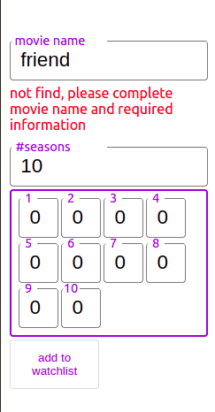

are you stop continuing to watch your favorite movie because of forgetting what was the last episode that you watched?
in this app create a list of movies and track your watched movies by date.

for example as you see for first season of game of throns episode 1 and 2 and 3 marked as watched in 12 april.

in the case of adding new movie to your watchlist, if movie previouslly added by other user you will see it, but if it's not in the database your must enter the No. seasons and each season's episode count. (as shown bellow)

# notes

1. see project's backend repository [here](https://github.com/j0053f/movie_watch_list_backend)
2. the project is live [here](http://141.11.246.192/)

# the tasks must be done:

`the list gradually updates`

- [ ] move state of app to redux
- [ ] show loading signs when something is loading
- [ ] dialog box to show server success and failer massages
